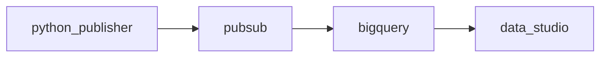

# google-cloud-csv-ingestion

Para visualizar os diagramas deste documento, recomendo usar o plugin Markdown Preview Mermaid Support, disponível no VS Code.

## Versionamento de código fonte

### Github

Vinculei minha chave pública na minha conta no Github e criei um repositório público, com o nome [google-cloud-csv-ingestion](https://github.com/flavioti/google-cloud-csv-ingestion) 


### Máquina local

```sh
git clone git@github.com:flavioti/google-cloud-csv-ingestion.git
```

Como boas práticas usei o padrão git flow. Instalei a ferramenta abaixo:

```sh
sudo apt-get install git-flow
```

## Arquiteturas

