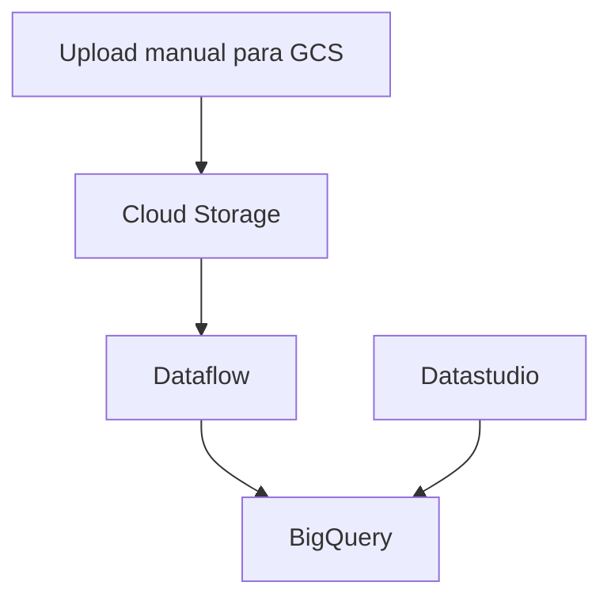
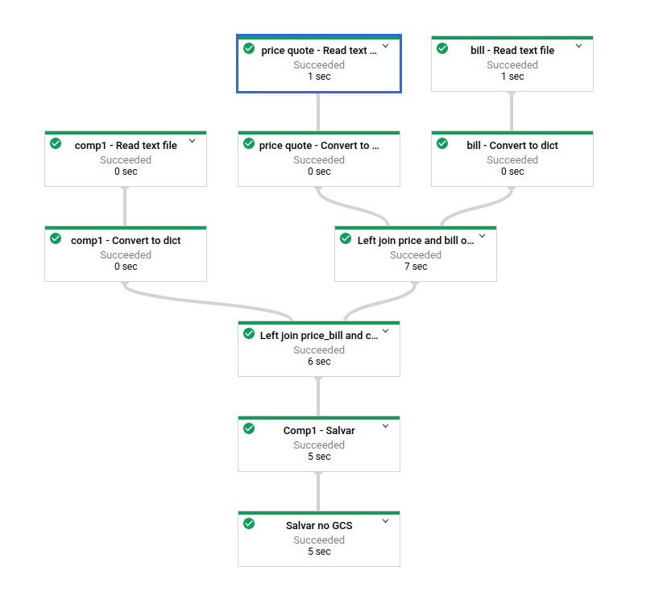
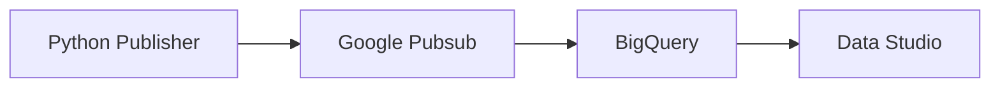
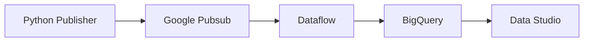
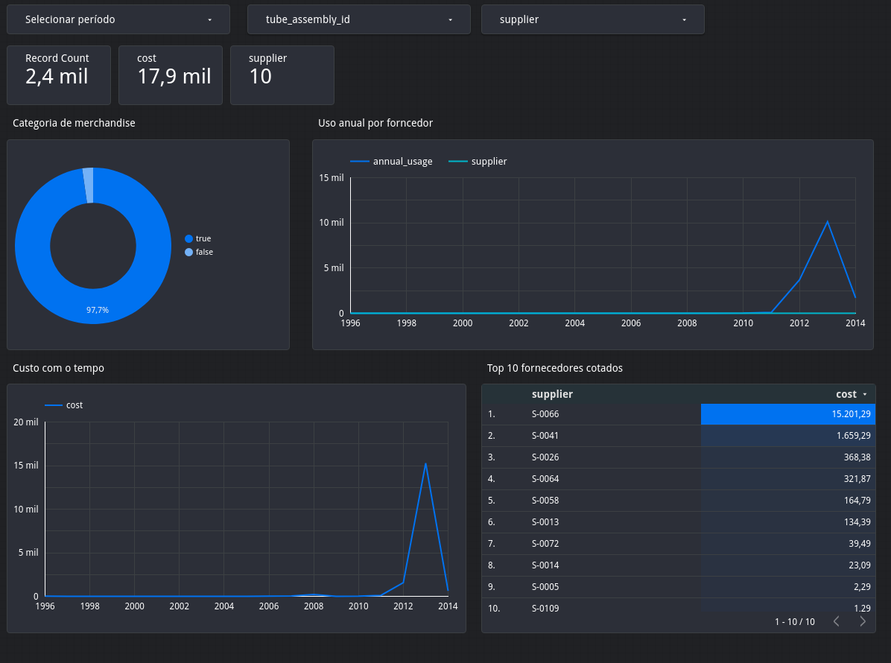

# google-cloud-csv-ingestion

## Sobre esse documento

- Para visualizar os diagramas de sequência, recomendo usar o plugin Markdown Preview Mermaid Support, disponível no VS Code.
- Outra opção é acessar [Mermaid Live Editor](https://mermaid-js.github.io/mermaid-live-editor), copiar e colar os diagramas para poder visualiza-los.
- Acima de cada diagrama existe um link para visualização alternativa em SVG

## Versionamento de código fonte

### Github

Vinculei minha chave pública na minha conta no Github e criei um repositório público, com o nome [google-cloud-csv-ingestion](https://github.com/flavioti/google-cloud-csv-ingestion) 

### Diretórios

- resources/ - Armazena imagens usadas neste documento.
- src/bigquery/ - Código Python usados para análise exploratória
- src/dataflow/ - Código Python usado no processo de transformação dos dados (Apache Beam).
- src/terraform/ - Código HCL para criação de dos recursos na nuvem com Infraestrutura como código
- src/deploy_beam_job.sh - Código em Shell Script para implantar a aplicação do Dataflow na plataforma GCP.
- src/upload_files.sh - Código em Shell Script para enviar os arquivos CSV da máquina local para o Google Storage.

### Máquina local

```sh
git clone git@github.com:flavioti/google-cloud-csv-ingestion.git
```

Como boas práticas usei o padrão git flow. Instalei a ferramenta abaixo:

```sh
sudo apt-get install git-flow
```

## Configuração do CLI (gcloud)

```sh
gcloud config configurations list
gcloud config configurations create pessoal
gcloud config configurations activate pessoal
gcloud config set account flaviomarcioti@gmail.com
gcloud config set project treinamento-254613
```

## Criação do dataset e tabela do BigQuery

Criei a tabela através do console, com base nos arquivos gerados no GCS

## Python (Preparação do ambiente)

```sh
sudo pip install virtualenv
type python3
virtualenv --python='/usr/bin/python3' python3
source python3/bin/activate
python --version
pip install google-cloud-bigquery
```

## Volume de dados

Os dados fornecidos são pequenos, usei o Dataflow mesmo não sendo a ferramenta adequada pois constava no enunciado.

## Arquitetura

[Arquitetura aplicada](resources/alternativa_a.svg) 



Captura de tela da aplicação em execução no Dataflow:




As alternativas de arquitetura abaixo são viáveis, mas não estavam no escopo e sua aplicação sairia do contexto do exame:

[Alternativa A](resources/alternativa_a.svg) 


Por serem somente 3 arquivos CSV pequenos que provavelmente serão ingeridos em lote, não vejo a necessidade de usar mensageria.

[Alternativa B](resources/alternativa_b.svg) 



[Alternativa C](resources/alternativa_c.svg) 


### Visualização dos dados

Link para relatório do Datastudio:

https://datastudio.google.com/reporting/f6f8b023-f194-4486-95f6-8e58dfdc177c

